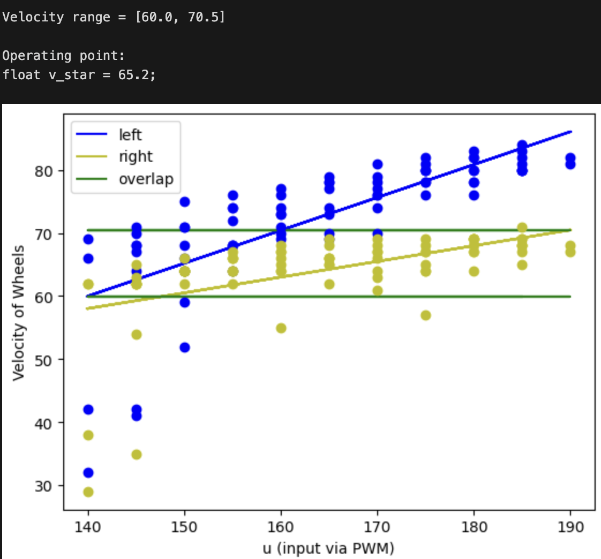
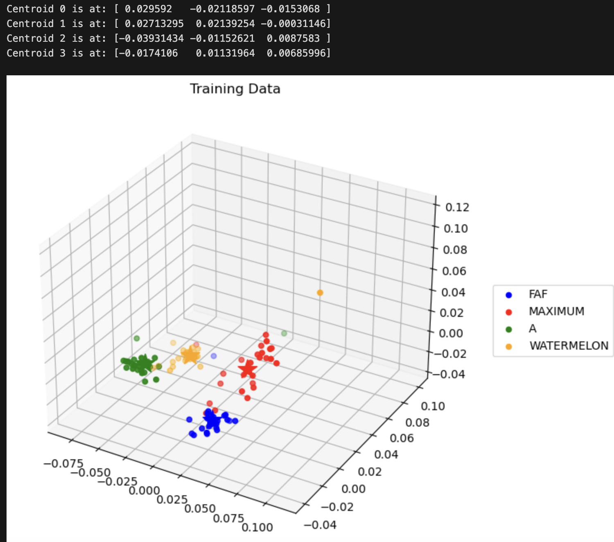

# Voice-Controlled Car

## Project Summary

Voice-controlled autonomous car built as part of UC Berkeley’s EECS 16B. The system integrates **analog signal conditioning, embedded firmware, system identification, closed-loop motor control, and lightweight machine-learning–based classification** on a resource-constrained microcontroller.

Spoken commands are processed through an analog front-end, projected into a low-dimensional PCA space for on-device classification, and mapped to motion behaviors (drive straight, turn, distance). Motor motion is regulated using **encoder feedback and a closed-loop controller derived from a least-squares plant model**, enabling robust performance despite motor mismatch and noise.

## Further Explanation

Battery powered car that listens to spoken commands, classifies them using a lightweight PCA-based approach, and executes motion behaviors (drive straight / turn left / turn right / short vs. far) using encoder feedback and closed-loop control.

## Demo Capabilities
- Voice-command classification (4 commands) using PCA projection + centroid-distance classification  
- Closed-loop straight-line driving with encoder feedback  
- Repeatable turning behavior via reference tracking  
- Fully battery-powered system with regulated 5V rail and PWM motor drive  

## System Architecture
**Microphone → Analog Conditioning → ADC Sampling → PCA Projection → Command Classification → Control Law → PWM Motor Drive → Encoder Feedback**

Key modules:
- **Analog front-end**: mic biasing, amplification, buffering, and filtering
- **Classifier**: PCA basis trained offline (SVD), fast inference on Arduino
- **Controls**: least-squares system identification + closed-loop feedback
- **Actuation**: PWM motor drive with driver stage and flyback protection

## What I Built

### 1) Mixed-Signal Front-End (Op-Amps + Filters)
Microcontrollers cannot sample negative voltages, so the audio input pipeline includes:
- Virtual ground biasing (~2.5V) to keep the signal within ADC range
- Buffer stages to prevent loading between circuit blocks
- AC coupling to remove DC drift
- Low-pass / high-pass / band-pass filters to attenuate noise and isolate useful signal content

**Reasoning**
- Embedded systems depend heavily on clean analog inputs
- Analog choices directly affect firmware reliability

### 2) System Identification via Least Squares
Instead of tuning PWM values manually, I fit a per-wheel linear model from real measurements.

Model:
v[k] ≈ θ·u[k] − β

Where:
- u[k] = PWM duty command
- v[k] = measured wheel velocity (encoder ticks per timestep)
- θ, β = parameters estimated from logged data

**code excerpt**
```
import numpy as np

def fit_wheel_model(u, v):
    u = np.asarray(u).reshape(-1, 1)
    v = np.asarray(v).reshape(-1, 1)

    A = np.hstack([u, -np.ones_like(u)])
    (theta, beta), *_ = np.linalg.lstsq(A, v, rcond=None)
    return float(theta), float(beta)
```

**Reasoning**
- Converts raw hardware data into a usable plant model
- Enables predictable and explainable control behavior
- Replaces guesswork with measurement-driven design

### 3) Closed-Loop Wheel Synchronization
DC motors differ due to friction, load, and manufacturing variance. To drive straight, I controlled the difference in wheel distance:

δ[k] = d_L[k] − d_R[k]

PWM commands are adjusted at each timestep using encoder feedback.

**code excerpt**
```
float delta = left_ticks - right_ticks;

float uL = (v_star - fL * delta + betaL) / thetaL;
float uR = (v_star + fR * delta + betaR) / thetaR;

uL = constrain(uL, PWM_MIN, PWM_MAX);
uR = constrain(uR, PWM_MIN, PWM_MAX);

analogWrite(LEFT_MOTOR_PIN,  (int)uL);
analogWrite(RIGHT_MOTOR_PIN, (int)uR);
```

**Reasoning**
- Implements embedded loop: sense → compute → actuate
- Encoder feedback compensates for disturbances and mismatch
- Shows practical gain tuning and stability tradeoffs

### 4) Turning via Reference Tracking
Turning is achieved by injecting a reference offset into the straight-line controller, intentionally creating curvature without rewriting the control stack.

**code excerpt**
```
delta_ref += delta_ref_step;
float delta_eff = delta + delta_ref;
```

**Reasoning**
- Reuses a stable controller for new behaviors
- Demonstrates trajectory control using minimal state

### 5) Embedded-Friendly Voice Classification with PCA
Full speech recognition is infeasible on a microcontroller, so the system uses:
1. Waveform recording and alignment
2. Projection into a low-dimensional PCA basis (trained offline via SVD)
3. Nearest-centroid classification in PCA space
4. Thresholding to reject noise and weak inputs

**code excerpt**
```
import numpy as np

def classify_command(x_raw, pca_basis, projected_mean, centroids):
    z = x_raw @ pca_basis
    z = z - projected_mean
    dists = np.linalg.norm(centroids - z[None, :], axis=1)
    return int(np.argmin(dists))
```

**Reasoning**
- Demonstrates embedded ML pattern: offline training, on-device inference
- PCA dramatically reduces memory and computation requirements
- Classifier is simple, explainable, and robust

## Results & Validation
The system was validated using:
- PWM vs velocity plots with least-squares fits
- Closed-loop convergence of wheel-distance error (δ)
- PCA clustering visualizations showing command separability

### System Identification & Modeling
The per-wheel motor dynamics were identified using least-squares regression. Linear models were fit directly from encoder measurements, and an operating point was selected from the region where both motors exhibit overlapping velocity ranges.



This model enables predictable control behavior and compensates for inherent motor mismatch.

Model validity was confirmed by integrating velocity over time and comparing predicted distance against encoder measurements:


### Closed-Loop Control Performance
A feedback controller was implemented to regulate the difference in wheel distance (δ) and ensure straight-line motion despite motor mismatch.


The controller drives steady-state error to zero while maintaining stability under model mismatch.

### Voice Command Classification
Spoken commands were projected into a low-dimensional PCA space trained offline using SVD. Classification is performed on-device via nearest-centroid distance.




Distinct clustering confirms separability of commands and enables reliable embedded inference with minimal memory and computation.

